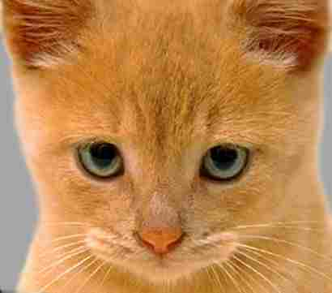

# Hybrid Image Generation

**MATLAB · Computer Vision · Image Processing**

## Academic context
- Undergraduate Computer Vision / Image Processing work
- Term 4012
- Original environment: MATLAB + Image Processing Toolbox

## Project
The project combines the low-frequency content of one image with the high-frequency detail of another to produce a hybrid image.

## Files
- [Interactive demo](demo/)
- [Original MATLAB source](src/hybrid_image_generator.m)
- [Dog input](assets/dog.jpg)
- [Cat input](assets/cat.jpg)

## Images

| Image A | Image B |
| --- | --- |
|  |  |
